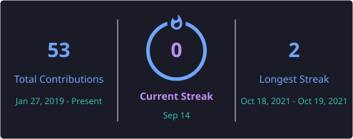

<div align="center">

# Pablo Crundall

### AI Agents · Site Reliability Engineering · Cloud Automation

**Building reliable systems at the intersection of AI, infrastructure and automation.**

<br>

[](https://github.com/pcrdll)

</div>

---

## About Me

I'm an engineer focused on **Site Reliability Engineering, cloud infrastructure, automation and AI agents**.

My work sits where software has to do more than return an answer: it needs to **observe a system, reason about what is happening, use tools safely and validate the result**.

```text
Observe  →  Reason  →  Plan  →  Act  →  Validate
```

---

## Current Focus

- **Agentic AI** — tool-using agents, orchestration and autonomous workflows
- **SRE** — reliability, incident prevention and operational safety
- **AWS** — cloud architecture and production operations
- **Infrastructure as Code** — Terraform-driven infrastructure
- **Observability** — metrics, logs, telemetry and system behavior
- **AI-assisted engineering** — code analysis, failure detection and engineering automation
- **Developer tooling** — reducing repetitive operational work through software

---

## Engineering Stack

### AI & Agentic Systems

`LLMs` · `AI Agents` · `LangGraph` · `Tool Calling` · `RAG` · `Multi-Agent Systems` · `Prompt Engineering`

### Cloud & Infrastructure

`AWS` · `Terraform` · `Docker` · `Linux` · `GitHub Actions` · `CI/CD` · `Infrastructure as Code`

### Reliability & Operations

`SRE` · `Observability` · `Monitoring` · `Incident Management` · `Automation` · `Distributed Systems`

### Development

`Python` · `FastAPI` · `REST APIs` · `React` · `JavaScript` · `SQL` · `Git`

---

## Engineering Principles

| Principle | What it means |
|---|---|
| **Observability first** | Measure the system before guessing |
| **Automate repetition** | Humans should solve new problems, not repeat old procedures |
| **Guardrails over blind automation** | Autonomous systems need limits and safe failure modes |
| **Infrastructure as Code** | Reproducibility beats manual configuration |
| **AI as an engineering primitive** | Agents should use tools and systems, not only generate text |
| **Reliability is a feature** | A system is not finished if it cannot survive production |

---

## GitHub Activity

<p align="center">
  
  
</p>

<p align="center">
  
</p>

> These cards are generated inside this repository by GitHub Actions, so the README does not depend on the old `github-readme-stats.vercel.app` endpoint.

---

## What I'm Building Toward

I am especially interested in engineering systems where AI can participate in real operational workflows:

```text
                         ┌─────────────────────┐
                         │      AI Agents      │
                         └──────────┬──────────┘
                                    │
                 ┌──────────────────┼──────────────────┐
                 │                  │                  │
                 ▼                  ▼                  ▼
          Code Analysis      Knowledge / RAG      Tool Calling
                 │                  │                  │
                 └──────────────────┼──────────────────┘
                                    │
                                    ▼
                         ┌─────────────────────┐
                         │   SRE Automation    │
                         └──────────┬──────────┘
                                    │
                    ┌───────────────┼───────────────┐
                    ▼               ▼               ▼
                   AWS          Terraform      Observability
```

The goal is not simply to make AI generate code.

The interesting problem is building systems that can **understand context, make bounded decisions, interact with real infrastructure and verify their own work**.

---

## Areas of Interest

`Agentic Engineering` · `Cloud Reliability` · `AI for Operations` · `Autonomous SRE` · `Developer Productivity` · `Platform Engineering` · `Infrastructure Automation`

---

<div align="center">

### Building systems that don't just answer questions —
### but understand what's happening and do something useful about it.

**AI · SRE · Cloud · Automation**

</div>
